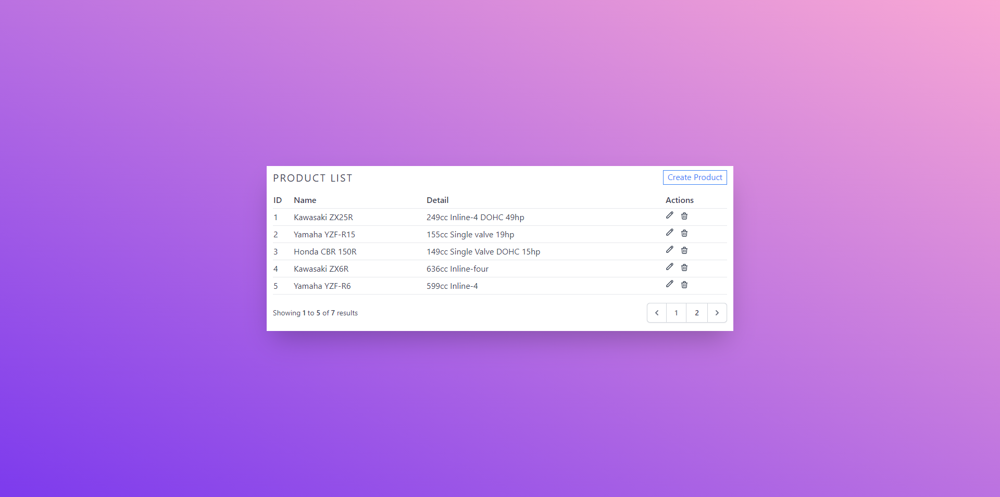
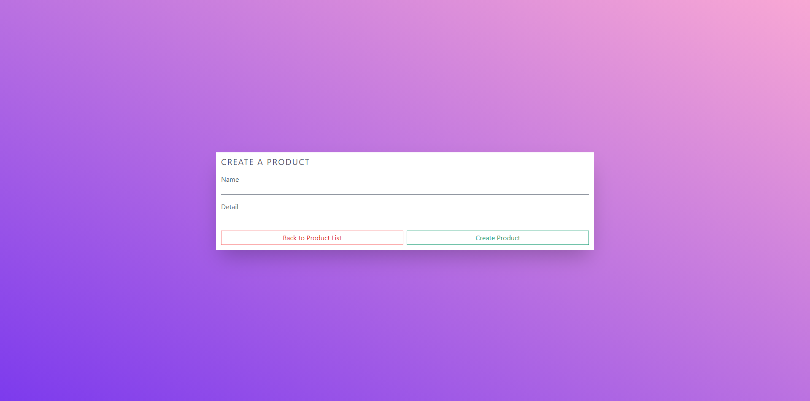
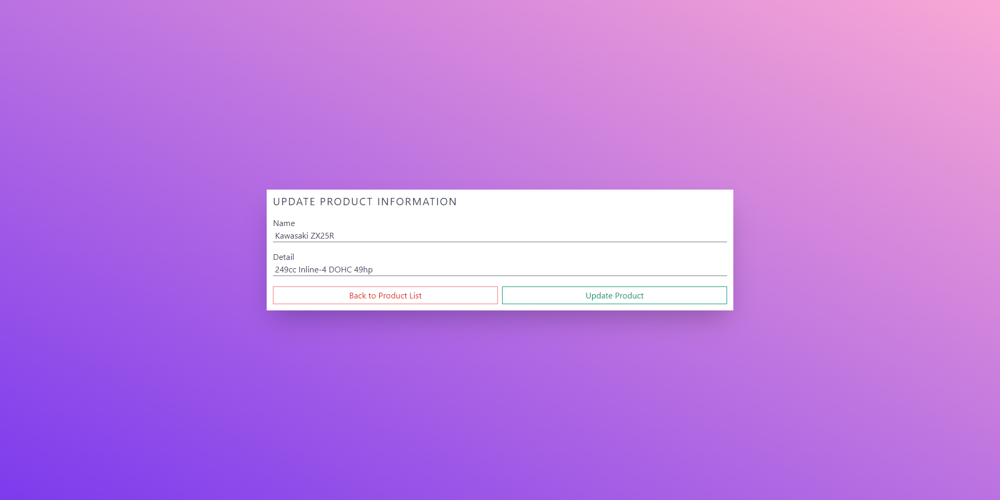

# Laravel CRUD
A simple Laravel CRUD web app.

## Setup
1. Install composer packages by: `composer install`  
1. Install npm packages: `npm install`  
1. Compile assets: `npm run dev`  
1. Serve the app: `php artisan serve`

## Preview
  
  
  
